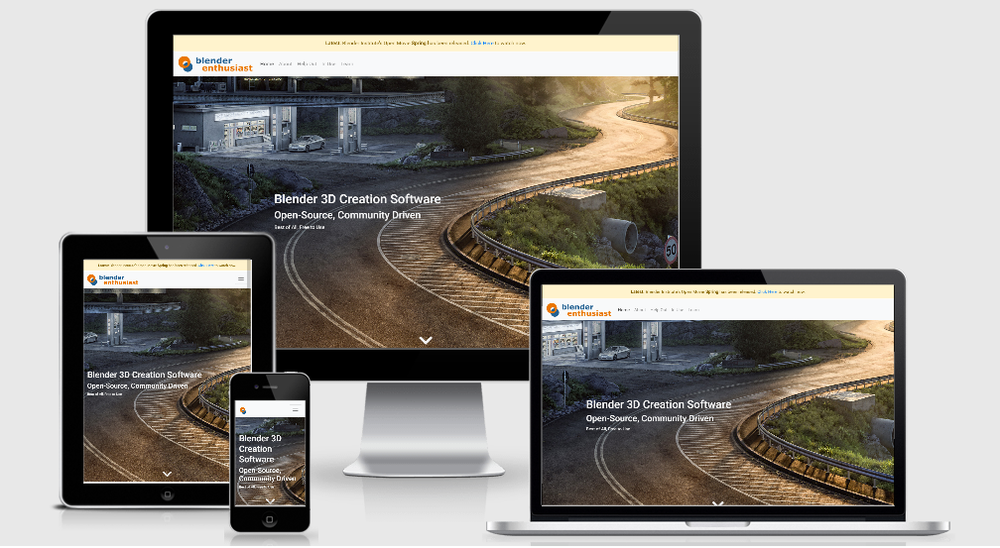
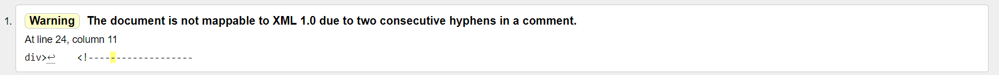

# Blender Enthusiast

An information website for Blender software. 
It gives a quality overview of the open source software.
Users can learn how to use Blender, see example uses and get involved in developing the software.
They can also download the software.

Hosted on [GitHub Pages](https://pattern-projects.github.io/blender-ucd-project/index.html)
Repository on [GitHub](https://github.com/Pattern-Projects/blender-ucd-project)

## License
The project is shared for use with the [GNU General Public License v3](LICENCE)

## UX


### Users 
Expected users of the website include 3D artists, educators, software developers and students of all kinds. 
They come to the website with questions in need of answering.

### User Stories
1. A student user wants to learn more about the blender software
2. A 3D artist user wants to download the latest version of blender
3. A technology enthusiast user wants a prerelease version of the software
4. A law student user wants to learn about the open software licence structure
5. An education professional user wants learn about the research process of blender
6. A 3D artist user wants to learn the software
7. A 3D artist user wants to improve their skills
8. An education professional user wants to share learning material with their students
9. A developer user wants to become involved in the developing of blender software

### Design

- Colour scheme made taken from blender logo colors
    - blender-orange:    `#EA7600`
    - blender-blue:      `#0E548B`
- [Custom designed logo](documentation/logo-no-text.png) using base shapes of the [blender logo](documentation/blender-logo.png)
- Profile style image box for the About page gives a personality to the software
- roboto font used throughout the website
    - font-family: 'Roboto', 'helvetica' sans-serif;

### Mockups

- [Home](https://www.figma.com/file/BAEdmRXdAFKWjGLucREMVBd0/Blender-Enthusiast?node-id=0%3A1)  
- [About](https://www.figma.com/file/BAEdmRXdAFKWjGLucREMVBd0/Blender-Enthusiast?node-id=4%3A83)  
- [Help Out](https://www.figma.com/file/BAEdmRXdAFKWjGLucREMVBd0/Blender-Enthusiast?node-id=4%3A21)  
- [In Use](https://www.figma.com/file/BAEdmRXdAFKWjGLucREMVBd0/Blender-Enthusiast?node-id=6%3A97)  
- [Learn](https://www.figma.com/file/BAEdmRXdAFKWjGLucREMVBd0/Blender-Enthusiast?node-id=6%3A173)  
 
## Features

Features planned, implemented and outlined for later development

### Planned Features
- Documentation - ReadMe File & Mockups
- Bootstrap - HTML, CSS Framework
    - Grid System - Columns and Rows
    - Cards
    - Icons
- Responsive design - Mobile First
- UX elements
    - User Flow
    - Animations
    - Transitions
    - Smooth Scrolling
- Accesibility
- Large Landing Page - Full screen landing image
- Semantic HTML - nav, article, etc
- Call to Action - Download Button
- Alert - Open Movie Call Out
- Social Buttons - Twitter, Discord, Linkedin
- Feedback Form
- Colour Scheme
- Custom Logo
- Favicon
- Testing
- Git - Version Control System
- GitHub - Remote Repository
- Deployed - Hosted on Github Pages

### Existing Features
- Documentation - ReadMe File & Mockups
- Bootstrap - HTML, CSS Framework
    - Grid System - Columns and Rows
    - Cards
    - Icons
- Responsive design - Mobile First
- UX elements
    - User Flow
    - Transitions
    - Smooth Scrolling
- Accesibility
- Large Landing Page - Full screen landing image
- Semantic HTML - nav, article, etc
- Call to Action - Download Button
- Alert - Open Movie Call Out
- Social Buttons - Twitter, Facebook, Slack, YouTube
- Colour Scheme
- Custom Logo
- Favicon
- Git - Version Control System
- GitHub - Remote Repository
- Deployed - Hosted on Github Pages

### Features Left to Implement
These features may be added at a later time.
- Add Blender organisation description to About page
- Add Blender organisational chart to About page
- Video backgrounds
- Full page image background
- Resizible sections
- Auto-update software version downloads
- Animations
- Feedback Form
- Live feed

## Technologies Used

- [HTML](https://developer.mozilla.org/en-US/docs/Web/HTML)
    - HTML for strucutre
- [CSS](https://developer.mozilla.org/en-US/docs/Web/CSS)
    - CSS for Styling
- [Google Chrome](https://www.google.com/chrome/)
    - Used for browser and dev tools
- [Mozilla Firefox](https://www.mozilla.org/en-US/firefox/new)
    - Used for browser and dev tools
- [Figma](https://www.figma.com)
    - Development made use of **figma** for creating mockups.
- [Inkscape](https://inkscape.org)
    - Custom logo created using **Inkscape**.
- [Google](https://www.google.com/)
    - **Google** was used for research.
- [Bootstrap](https://getbootstrap.com/)
    - HTML and CSS Framework from **Bootstrap**
    - [**JQuery**](https://jquery.com/) used by Bootstrap components
    - [**JavaScript**](https://www.w3schools.com/js/) used by Bootstrap components
- [Font Awesome](https://fontawesome.com/)
    - Icons used are sourced from **Font Awesome**
- [Cloud9](https://c9.io/)
    - This project was built using the **Cloud9** IDE
- [Git](https://git-scm.com/)
    - **Git** used for Version Control
- [GitHub](https://github.com/)
    - Repository hosted on **GitHub**
- [Github Pages](https://pattern-projects.github.io/blender-ucd-project/in-use.html)
    - Website hosted on **Github Pages**
- [Colour Scheme Designer](https://colorschemedesigner.com/csd-3.5/)
    - Colour scheme developed using **Colour Scheme Designer**
- [Google PageSpeed Insight](https://developers.google.com/speed/pagespeed/insights/)
    - Used to test the websites performance efficiency
- [Nu HTML checker](https://validator.w3.org/nu/)
    - Used to test the website for errors

## Testing

The site was tested through a number of means.

### User Stories
The user stories created during the design phase were inacted:
1. A student user wants to learn more about the blender software
    - From the Home page through the others the user learns about the software
2. A 3D artist user wants to download the latest version of blender
    - On the Home page the user clicks the main download button
    - The user clicks ok in the dialog box
    - The file is downloaded
3. A technology enthusiast user wants a prerelease version of the software
    - On the Home page the user clicks the 2.80 download button
    - The user clicks ok in the dialog box
    - The file is downloaded
4. A law student user wants to learn about the open software licence structure
    - On the About page the user reads the allowances provided by the GNU General Public License
5. ~~An education professional user wants learn about the research process of blender~~
    - This task is outside the purview of the completed site
    - A section could be added at a later date to include this information
6. A 3D artist user wants to learn the software
    - The software is downloaded from an available link
    - From the Learn page the user finds the Blender Cloud link
7. A 3D artist user wants to improve their skills
    - From the Learn page the user finds lessons on using the software
8. An education professional user wants to share learning material with their students
    - From the In Use page the user finds links to complete projects to share with students
    - From the Learn page the user finds links to dedicated study websites
9. A developer user wants to become involved in the developing of blender software
    - From the Help Out page the user learns about the process of developing for Blender
    - From the Help Out page they connect to the Blender developer hub

### HTML Check



Using W3's [Nu HTML Checker](https://validator.w3.org/nu/) the website was checked for structure and syntax validation.

Issues returned were of the following type:
- Warning: The document is not mappable to XML 1.0 due to two consecutive hyphens in a comment
    - These were a straightforward fix, changing hyphens for asterisks.
- Error: Bad value opens dropdown on mobile screens for attribute role on element button.  
    - This was solved by removing unneccessary roles and adding correct roles where neccessary.

Solving the remaining errors and warnings is outside of the current scope of the project

### Performance

Using Google's [PageSpeed Insights](https://developers.google.com/speed/pagespeed/insights/) the website was tested for network performance.
The results were:
- [Desktop:  100%](documentation/desktop-performance.png)
- [Mobile:   99%](documentation/mobile-performance.png)

Suggestions provided to improve mobile performance include:
- Serve images in next-gen formats
- Eliminate render-blocking resources

### Bugs
1. Home screen - large image fit changes by screen
    
    - On mobile the browser bar pushes down the webpage.
    - Bottom of the page is off screen
    - This [Google Developers](https://developers.google.com/web/fundamentals/native-hardware/fullscreen/#fake_it_auto-hide_the_address_bar) page describes solutions to this issue
    - These solutions are either hacky or outside of the current scope of the project
    - They may be revisited at a later date
2. Irregularly occuring image error on firefox.
    - [Image corrupt or truncated.]
    - Does not appear on every refresh.
    - This [StackOverflow link](https://stackoverflow.com/questions/32459621/how-to-handle-image-corrupt-or-truncated-in-firefox) refers to JQuery as the source of the issue
    - Bootstrap jquey links added to the bottom of the pages are the likely culprit
    - Further investigation required
3. There is what looks like a [single pixel gap](documentation/gap.png) to the right of the page
    - It can be detected by increasing the page zoom and looking at the footer
    - It appears this gap is found on many websites including [blender.org](https://www.blender.org/) and [getbootstrap.com](https://getbootstrap.com/)
    - If it is a bug at all it is outside the scope to the project to solve it

### Bug Fixes
1. test-file.txt not downloading after dialog box
    - The file was not stored in assets folder so that addresses were incorrect
    - Moved test-file.txt to the assets folder
    - Issue resolved
2. Cannot move navbar items to the right
    - navbar div had a mr-auto class holding it in place
    - Changed it to ml-auto
    - Issue resolved

## Deployment

The project is hosted on [GitHub Pages](https://pattern-projects.github.io/blender-ucd-project/index.html)

The process involved:
- Host a git repository on GitHub. Explained [here](https://help.github.com/en/articles/create-a-repo).
- root folder contains README.md and index.html files
- On GitHub repository settings page move to GitHub Pages section
- Change source to master branch. (Or any desired branch)
- Provided link will be your projects home (index) page.
 
To deploy your own version of the website:
- Have git installed
- Visit the [repository]([GitHub](https://github.com/Pattern-Projects/blender-ucd-project))
- Click 'Clone or download' and copy the code for http
- Open your chosen IDE (Cloud9, VS Code)
- Open a terminal in your root directory
- Type 'git clone ' followed by the code taken from github repository
    - ```git clone https://github.com/Pattern-Projects/blender-ucd-project.git```
- When this completes you have your own version of the website
    - Feel free to make any changes to it
- The website can be run by opening one of the HTML files within a web browser
- Visit the link provided
- Your website with any made changes will appear
- Saved changes to the website will appear here after refreshing the page

The benefits of hosting your website on GitHub pages is that any pushed changes to your project will automatically update the website. Development branches can be created and merged to the master when complete.

It may take a moment for changes to appear on the hosted website.

During development the site is hosted using cloud9's local server feature. It runs in the browser.

## Credits

### Content
Some of the text on the website has been copied from:  
- [blender.org](https://www.blender.org/)

### Media
The images for the website are taken from:
- [blender.org](https://www.blender.org/)
- [Manuel Peter](https://www.artstation.com/manuel-peter)
- [Matuesz Wielgus](https://www.artstation.com/mateusz_wielgus)
- [Guilherme Henrique](https://www.artstation.com/sepultura)
- [Lukas Walzer](https://www.artstation.com/lukas_walzer)
- [Rico Cilliers](https://www.artstation.com/ricocilliers)
- [Lester Banks](https://lesterbanks.com/2014/10/demolishing-building-blender/)
- [Grant Abbitt](https://www.artstation.com/artwork/dO44le)
- [Blender Nation](https://www.blendernation.com/headers/blender-developers-improved/)
- [LinkedIn Learning](https://www.linkedin.com/learning/sculpting-a-game-asset-in-blender)
- [Udemy](https://www.udemy.com/character-animation-for-beginners/)
- [User Elbrujodelatribu - Stack Exchange](https://blender.stackexchange.com/questions/5593/any-good-free-materials-libraries-online)

### Acknowledgements

Thank you to the following for inspiration, motivation and the direction I needed:

- Andrew Price
- Grant Abbitt
- Ton Roosendaal
- Blender Institute

- [CSS-Tricks](https://css-tricks.com/)
- [Avex Designs](https://avexdesigns.com/)

- Seun Owonikoko    @seun_mentor
- Anna Greaves      @Anna_lead
- Simen Daehlin     @Eventyret_mentor
- Code Institute